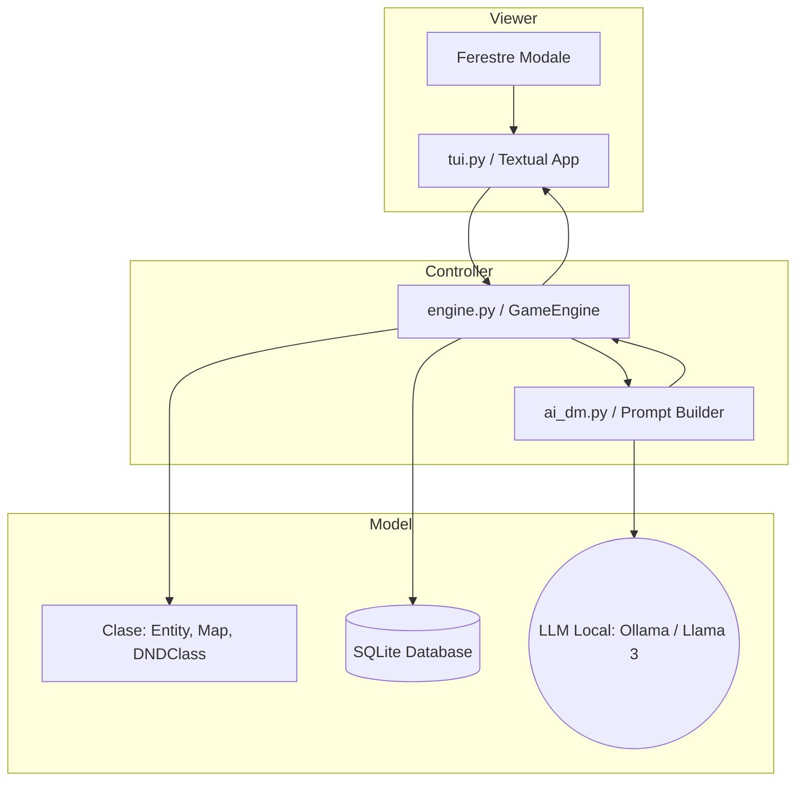
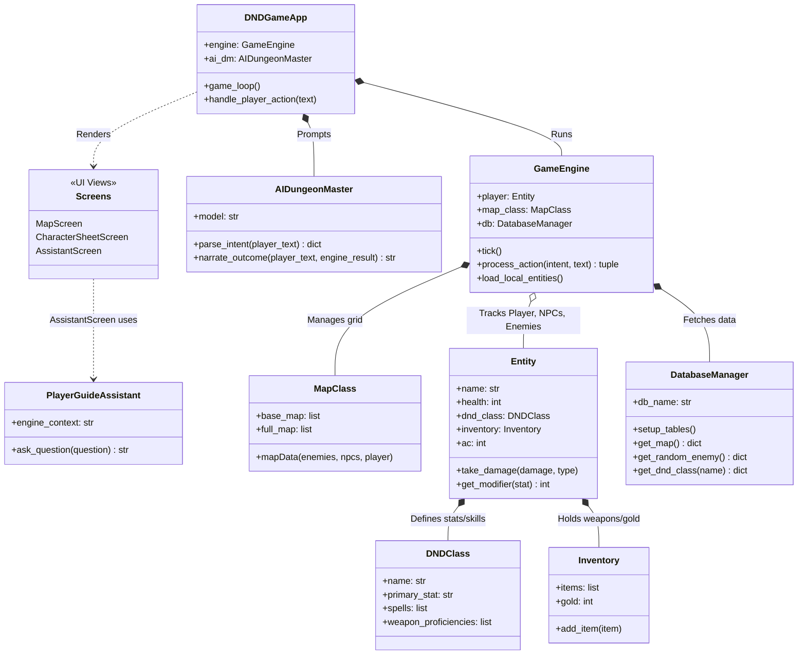
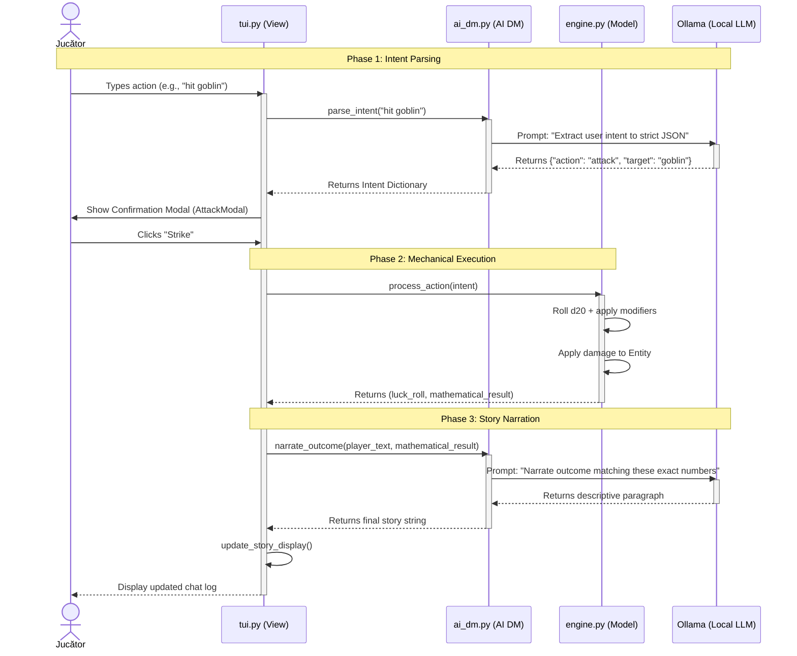

# Procesul de dezvoltare pentru Proiect

## Integrarea Agenților AI

Aplicația integrează cu succes doi agenți AI distincți, rulați complet local folosind Ollama, modelul Llama 3. 

1. Agentul "AI Dungeon Master" (`ai_dm.py`)
- Rol: Gestionează narațiunea interactivă, interacțiunile cu lumea și decodificarea intențiilor.
- Funcționalitate: Traduce input-ul natural al jucătorului în comenzi JSON structurate pentru motorul jocului. După ce motorul calculează determinist rezultatul, agentul preia datele matematice și le dă o narațiune dinamică. De asemenea, generează replici contextuale pentru NPC-uri, reacționând la starea mediului înconjurător.

2. Agentul Asistent "Player Guide" (`ai_assistant.py`)
- Rol: Funcționează ca un manual de instrucțiuni interactiv și ghid tehnic in-game.
- Funcționalitate: Este un agent code-aware. El poate accesa și citi direct fișierele sursă `.py` ale proiectului pentru a explica jucătorului regulile exacte ale jocului. Această abordare tehnică previne halucinațiile modelului, asigurând că răspunsurile sunt întotdeauna bazate pe mecanicile reale implementate în cod.

## Specificații

1. Viziunea Proiectului
Un RPG text-based în terminal, care îmbină logica matematică a unui motor D&D (HP, zaruri, statistici) cu narațiunea generată dinamic de un LLM rulat local.

2. Cerințe Funcționale
- Character Creator: Interfață pentru definirea personajului (Nume, Clasă, Rasă, Background) și alocarea automată a atributelor (HP, STR, etc.).
- Turn-Based Combat: Sistem automatizat de atac/apărare, care calculează determinist rezultatul (zaruri, modificatori) și include contra-atacul inamicului în aceeași rundă.
- Dialog Dinamic (AI): Sistem de interacțiune cu NPC-urile, unde AI-ul generează replici conștiente de contextul jocului (inamici în viață, quest-uri).
- Player Guide "Code-Aware": Asistent tehnic in-game capabil să citească fișierele `.py` pentru a ghida jucătorul bazat strict pe mecanicile reale implementate.
- TUI (Terminal User Interface): Interfață vizuală interactivă (Textual) cu log-uri de poveste, hărți, inventar și ferestre modale pentru confirmări sau "Game Over".

3. Cerințe Non-Funcționale
- Execuție Locală: Integrare cu Ollama (ex: Llama 3) pentru confidențialitate totală și costuri zero.
- Arhitectură Decuplată: Separare clară între UI (`tui.py`), logică (`engine.py`) și serviciile AI (`ai_dm.py`).
- CI/CD & Portabilitate: Workflow GitHub Actions pentru testare automată (`pytest`) și compilare într-un singur fișier executabil (`.exe`) folosind PyInstaller.
- Procesare Asincronă: Apelurile către modelul AI nu trebuie să blocheze firul principal de execuție al interfeței grafice.

## Backlog-uri
Au fost create folosind JIRA, creand story-uri si task-uri carora le putem da track.


### Diagrama UML

## Descriere Arhitectura

### Diagrama de Arhitectură a Componentelor


### Diagrama de Clase UML


### Workflow Action (Sequence Diagram)


## Source control cu git
- Pentru a realiza proiectul, ambii studenti au creat noi branch-uri si dat merge acestora 
- Ambii studenti au participat in mod activ la realizarea proiectului, de la alegerea temei si tehnologiilor folosite pana la 
scrisul de cod si rezolvatul de bug-rui
- Ambii studenti au peste 5 commit-uri

## Teste automate
Este integrat un pipeline GitHub Actions care rulează o suită de teste automate (folosind framework-ul `pytest`) la fiecare *push*. Aceste teste validează logica de bază a motorului de joc (calculul de HP, generarea instanțelor, răspunsul acțiunilor) înainte ca executabilul să fie compilat.

## Verificări Formale
Arhitectura aplică verificări statice ușoare. Se utilizează *Type Hinting* strict pentru metodele critice (ex: `target_name: str`, `luck_roll: int` în `engine.py`) pentru a preveni propagarea erorilor de tip la runtime. De asemenea, motorul menține invarianți matematici clari (ex: HP-ul entităților nu poate fi evalut sub 0, zarurile d20 sunt mărginite strict la intervalul [1, 20]), garantând coerența stării sistemului indiferent de input-ul generat de AI.

## Raportare bug
O eroare logică legată de mecanica jocului a fost depistată și documentată oficial pe GitHub. Issue-ul conține descrierea problemei.
Soluția a fost implementată pe un branch separat și izolată de restul codului. Ulterior, corecția a fost revizuită și integrată în ramura principală.
[Link](https://github.com/Mach3tryhard/AI-Dungeon-Master/issues/30)

## Design Patterns
Proiectul utilizeaza Design Pattern-ul Model - View - Controller.

## Folosirea instrumentelor AI
- Arhitectură: AI-ul a asistat la implementarea design-ului **MVP**, decuplând logica deterministă (`engine.py`) de serviciul narativ (`ai_dm.py`). Acest lucru a asigurat că starea jocului (HP, datele din SQLite) nu poate fi coruptă de eventuale "halucinații" ale modelului.
- Implementare UI: Generarea rapidă de cod *boilerplate* pentru componentele interfeței (ferestre modale, layout-uri, animația zarului) și depanarea stilizărilor CSS în terminal.
- DevOps & CI/CD: Diagnosticarea erorilor de sintaxă în scripturile PowerShell din GitHub Actions și rafinarea comenzilor PyInstaller (`--add-data`) pentru a include corect resursele statice în executabil.
- Documentație & UML: Traducerea logicii scrise în sintaxă `Mermaid.js` pentru generarea rapidă a diagramelor de componente, secvență și clase UML.
- Acest markdown a fost generat inițial cu AI și corectat de către noi.

# AI Dungeon Master: Terminal RPG

A highly immersive, text-based Dungeons & Dragons experience built entirely in Python. This project bridges the gap between traditional deterministic game engines and modern Generative AI, featuring a fully functional Terminal User Interface (TUI) and an AI Dungeon Master that dynamically narrates your actions, controls NPCs, and acts as a code-aware player guide.

## Core Features

* **Deterministic Game Engine:** Under the hood, a strict Python engine handles stats, HP tracking, inventory, map coordinates, and d20 dice rolls to ensure fair and mathematically sound gameplay.
* **AI-Powered Narrative:** The engine's raw numerical outputs (e.g., "Player rolled 18, dealt 6 damage, Goblin has 4 HP left") are fed directly into a local Large Language Model (Llama 3) to generate rich, contextual, and immersive storytelling on the fly.
* **Dynamic Turn-Based Combat:** Engage in combat with automated enemy counter-attacks, weapon damage calculation, and a seamless Game Over/Restart loop.
* **Intelligent NPC Dialogue:** Talk to characters in the world. The AI generates their responses based on the current game state, remaining enemies, and active quests.
* **Code-Aware Player Guide:** An in-game assistant that can read the project's actual `.py` source code to accurately teach players how to use the game's mechanics without hallucinating controls.
* **Modern TUI:** A responsive terminal interface built with Textual, featuring pop-up modals, stat tracking, and real-time chat logs.
* **Automated CI/CD Pipeline:** Fully integrated GitHub Actions workflow for testing (`pytest`) and automatically compiling portable `.exe` releases using PyInstaller.

## Tech Stack

* **Language:** Python 3.12+
* **Interface:** [Textual](https://textual.textualize.io/) (for the TUI)
* **AI Engine:** [Ollama](https://ollama.com/) (running Llama 3 locally)
* **Testing & Build:** `pytest`, GitHub Actions, PyInstaller

## How to Play (Portable Release)

The easiest way to play the game is by downloading the latest automated release. No Python installation is required!

1. Go to the **Releases** tab on this GitHub repository.
2. Download the latest `DND_Game.zip` archive.
3. Extract the folder to your Desktop or Documents (Do not run it directly from inside the ZIP).
4. Ensure you have [Ollama](https://ollama.com/) installed and running on your system with the `llama3` model pulled (`ollama run llama3`).
5. Double-click `DND_GAME.exe` to start the adventure!

## Developer Setup (Running from Source)

If you want to modify the codebase or run the game directly through Python:

1. Clone the repository:
```bash
git clone https://github.com/yourusername/AI-Dungeon-Master.git
cd AI-Dungeon-Master
```

2. Install the required dependencies:
```bash
pip install -r requirements.txt
```

3. Start the Ollama server in the background (if not already running).
4. Launch the game interface:
```bash
python UI/tui.py
```

## Project Architecture

* `UI/tui.py`: The main entry point. Handles the Textual application, layout, styling, and user input mapping.
* `engine.py`: The core deterministic logic. Manages combat math, movement, state tracking, and the underlying rules of the universe.
* `ai_dm.py`: The translation layer between the game engine and the Ollama API. Injects engine data into system prompts to generate the narrative.
* `presets.py`: Data dictionaries containing class stats, starting equipment, and race bonuses.
* `.github/workflows/`: Contains the CI/CD configuration for automated smoke testing and executable generation.

## Authors

**Matei Sîrghe-Ștefan** 
**Ștefan Bujor** 
*Computer Science Engineering Students* 
University of Bucharest, Faculty of Mathematics and Informatics


